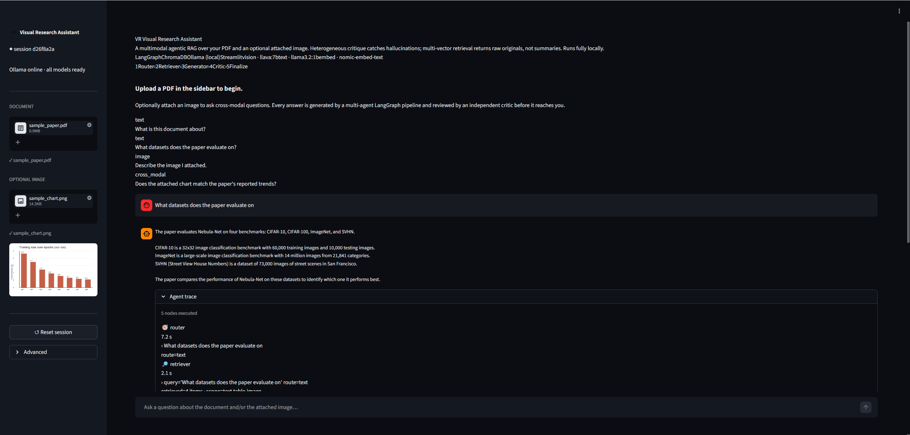
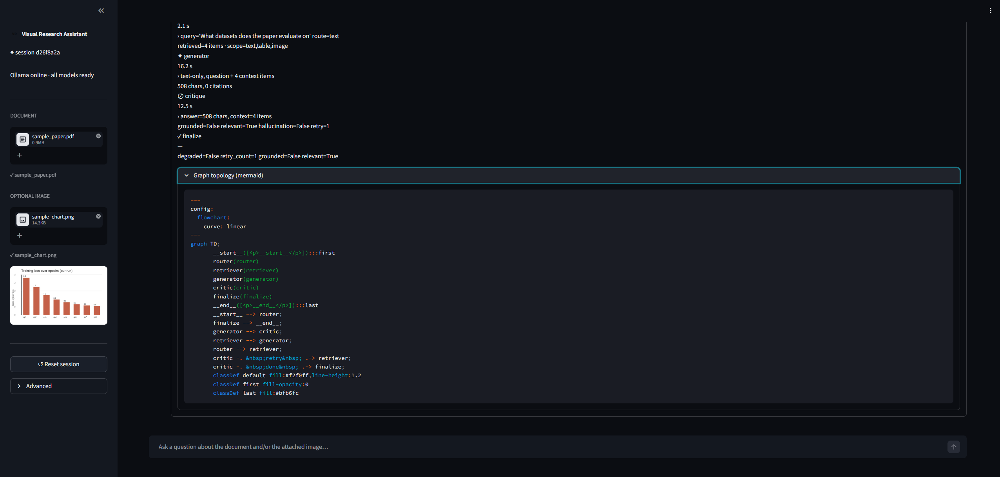

<h1 align="center">Visual Research Assistant</h1>

<p align="center">
  <b>Multimodal Agentic RAG with self-correction, running fully locally.</b><br>
  LangGraph · ChromaDB · Ollama · Streamlit
</p>

<p align="center">
  <a href="#architecture">Architecture</a> ·
  <a href="#features">Features</a> ·
  <a href="#quickstart">Quickstart</a> ·
  <a href="#how-it-works">How it works</a> ·
  <a href="#project-layout">Project layout</a>
</p>

---

## Overview

A "chatbot over a PDF" is table stakes. This project goes further: it's an **agentic** system that reasons across text, tables, and figures with **bounded self-correction**, and it runs end-to-end on a consumer GPU with no cloud dependencies.

You upload a PDF and, optionally, a separate image. You ask a question. A **LangGraph** multi-agent pipeline routes the question, retrieves the right context via **multi-vector retrieval**, drafts an answer, and has that draft independently reviewed by a **critic running on a different model family** before it ever reaches you. Hallucinations that survive the critic trigger a single bounded retry; everything else is answered on the first pass.

The project is designed as a portfolio-grade artefact: typed config, structured JSON logs, a typed exception hierarchy, mypy-strict source, CI (Ubuntu + Windows), Docker Compose, and 42+ unit tests.

---

## Why this is interesting

| Idea | Implementation |
|---|---|
| **Multi-vector retrieval** | We embed LLM-generated *summaries* of tables (and optionally figures), but the retriever returns the *originals* — raw table HTML, raw image bytes. The generator reasons on dense, readable context, not OCR noise. |
| **Heterogeneous critique** | The generator is a vision-capable LLM (LLaVA). The critic is a text-only LLM from a different family (Llama 3.2). Different weights → genuinely independent judgement, no self-agreement bias. |
| **Bounded retry with graceful degradation** | The critic produces structured output (Pydantic schema). Hallucinations trigger one rewritten-query retry; after that the answer is surfaced with an explicit "degraded" warning. A transparent weak answer beats an infinite loop. |
| **Route-aware multimodality** | A router classifies each question as `text` / `image` / `cross_modal` and lets the downstream nodes act accordingly: text-only questions skip the vision model entirely; attached images are kept separate from the document so they don't contaminate document answers. |
| **Session isolation** | Every vector carries a `session_id` metadata tag; every Chroma search applies a metadata filter. Cross-session leakage is architecturally impossible. |
| **Full observability** | Structured JSON logs on disk, optional LangSmith tracing, and an in-app timeline panel showing the router → retriever → generator → critic → finalize path with per-node durations. |

---

## Demo

<p align="center">
  
</p>

<p align="center">
  <sub>Sidebar: session chip · health indicator · PDF + image uploads.  Main panel: cited answer + expandable agent trace.</sub>
</p>

<p align="center">
  
</p>

<p align="center">
  <sub>Every answer ships with a timeline trace of every node (router · retriever · generator · critic · finalize) and the compiled LangGraph topology.</sub>
</p>

The UI ships with a polished dark theme, a welcome/empty state that pitches the project in three seconds, cyan citation badges on every `[doc_id]` reference, and an agent-trace timeline with color-coded status per node (ok · retry · error · finalize).

Example end-to-end behaviour on a 12-page synthetic research paper:

| Question | Route | Source used | Behaviour |
|---|---|---|---|
| "What is this document about?" | `text` | document only | Clean summary, first-pass pass |
| "What datasets does the paper evaluate on?" | `text` | document only | Returns the four datasets, cites the table |
| "Describe the image I attached" | `image` | attached image via LLaVA | Chart description |
| "Does the attached chart match the paper's trends?" | `cross_modal` | both | Side-by-side comparison |
| *"Who is the CEO of OpenAI?"* (adversarial) | `text` | document only | Document cannot answer → honest refusal, `degraded=true` when critic flags a hallucinated guess |

---

## Architecture

```
                ┌─────────────────────────────────────────────────────────┐
User PDF  ──► │ Ingestion                                               │
              │   PyMuPDF partition (text + tables + figures)           │──► ChromaDB (summaries indexed,
User IMG  ──► │   Figure/table summarization via Ollama                 │     metadata-filtered per session)
              │   Chunking · embedding (nomic-embed-text)               │──► JSON docstore (originals)
              └─────────────────────────────────────────────────────────┘

                                                              │
                                                              ▼
User Q  ──►  Router  ──► Retriever  ──► Generator  ──► Critic  ─┬──► END (answer + trace)
                           ▲                                   │
                           │   rewritten retrieval query        │
                           └───────────────────────────────────┘
                                  retry (hard cap = 1)
```

- `StateGraph` compiled with a `SqliteSaver` checkpointer so every run is resumable and inspectable.
- `MultiVectorRetriever` pattern: embed summaries, return originals.
- `Pydantic` structured output on the critic, so the retry decision is a typed boolean — no regex-parsing of JSON.
- Generator picks between a fast text model and the vision model *based on the route*, so text-only questions don't pay the VL inference tax.

---

## Features

- 🧭 **4-node LangGraph pipeline** — Router, Retriever, Generator, Critic, plus a Finalize node that sets the `degraded` flag.
- 🔎 **Multi-vector retrieval** — summaries embedded, originals returned.
- 🧬 **Heterogeneous critic** — different model family from the generator.
- ♻️ **Bounded retry** — retries only on hallucination (the one failure mode a retry reliably fixes); everything else surfaces on the first pass.
- 🖼️ **Route-aware multimodality** — text-only questions skip the vision model entirely; attached images stay out of document answers.
- 🛡️ **Upload validation** — MIME sniffing, size caps, page caps, filename sanitisation, path-traversal guards.
- 🔒 **Session isolation** — `session_id` metadata filter on every retrieval.
- 🧾 **Structured logs** — `structlog` JSON, one line per node execution, session-scoped.
- ⚙️ **Typed config** — `pydantic-settings`; every knob is env-driven and validated on startup.
- 🧪 **CI** — Ruff · Black · mypy · pytest on Ubuntu + Windows.
- 🐳 **Docker Compose** — one-command demo that bundles Ollama + the app.
- 🎨 **Polished UI** — dark theme, cyan citation badges, timeline-style agent trace.

---

## Quickstart

### Prerequisites

- Python 3.11+
- [Ollama](https://ollama.com/download) installed and running
- (Windows only) [Poppler](https://github.com/oschwartz10612/poppler-windows/releases/) on `PATH` for PDF parsing

### 1. Clone + install

```bash
git clone https://github.com/Aashan47/Visual-Research-Assistant-Multimodal-Agentic-RAG.git
cd Visual-Research-Assistant-Multimodal-Agentic-RAG

python -m venv .venv
# Windows
.venv\Scripts\Activate.ps1
# macOS / Linux
source .venv/bin/activate

pip install -r requirements.txt
```

### 2. Pull the models

```bash
# Unix
bash scripts/pull_models.sh

# Windows PowerShell
.\scripts\pull_models.ps1
```

This pulls the three default models (~7 GB total disk, tuned to fit comfortably on a 6 GB VRAM card):

- `llava:7b` — vision generator (used only when an image is in context)
- `llama3.2:1b` — fast text generator, critic, router
- `nomic-embed-text` — embeddings

### 3. Configure

```bash
cp .env.example .env
# fill in LANGSMITH_API_KEY if you want tracing (optional)
```

### 4. Run

```bash
streamlit run run.py
# → http://localhost:8501
```

Upload a PDF in the sidebar, optionally attach an image, and start asking questions. On first launch you will see a welcome card with four example prompts covering every route.

### Sample assets

Run `python scripts/make_demo_assets.py` to generate `examples/sample_paper.pdf` and `examples/sample_chart.png`. The paper is a synthetic 12-page ML report (title, abstract, method, results table, a figure) and the chart is a standalone training-loss plot that deliberately differs from the paper's figure, so you can see the cross-modal comparison behaviour clearly.

### Docker (one command, no manual Ollama/Poppler install)

```bash
docker compose up --build
# → http://localhost:8501
```

Compose spins up a dedicated Ollama service, pulls the required models on first boot, and runs the Streamlit app with a shared volume for persistent state.

---

## How it works

### Ingestion pipeline

1. **Upload validation** — MIME-sniff, size cap, page cap, filename sanitisation, path-traversal guard (`src/ingestion/validators.py`).
2. **Partition** — PyMuPDF extracts text blocks per page and native tables via `find_tables()` (`src/ingestion/pdf_partitioner.py`).
3. **Figure extraction** (optional, toggleable in the sidebar) — PyMuPDF grabs embedded bitmaps first; if a page has no embedded bitmap it falls back to a full-page raster at 100 DPI.
4. **Summarization** — images go through the vision model; tables go through the text model with an HTML-as-input prompt. Summaries are 80–150 words and retrieval-optimised.
5. **Chunking** — `RecursiveCharacterTextSplitter(800, 150)` on the full narrative text blob.
6. **Indexing** — summaries are embedded via `nomic-embed-text` and written to Chroma with metadata `{doc_id, source_type, session_id, page_number, ingest_ts}`. Originals (raw text chunks, raw table HTML, raw base64 PNGs) are persisted to a local JSON docstore keyed by `doc_id`.

### Retrieval

`MultiVectorRetriever` pattern — the Chroma similarity search runs over summary embeddings, then the matched `doc_id`s are used to fetch the **originals** from the docstore. The generator therefore reasons on raw table HTML, raw images, and raw prose, not on summarised text.

Retrieval scope depends on the route:

- `text` → `text`, `table`, `image` (document content only; user image excluded)
- `image` → `user_image` only
- `cross_modal` → all source types

### Agent graph

`AgentState` is a `TypedDict` with a `trace: Annotated[list[dict], add]` reducer so every node appends its own trace entry. Nodes:

- **Router** — classifies the question into `text` / `image` / `cross_modal`. Six few-shot examples in the prompt. Defaults to `text` on ambiguity.
- **Retriever** — pulls the session-scoped, route-scoped context from Chroma and swaps embeddings for originals.
- **Generator** — picks the vision or text model based on the route. Emits prose with `[doc_id]` citations. Never mentions internal scaffolding tags.
- **Critic** — runs on a different model family from the generator. Produces structured output via Pydantic: `grounded` · `relevant` · `hallucination` · `reason` · `rewrite_query`. Has a defensive fallback if the critic itself fails, so the graph never crashes mid-flight.
- **Finalize** — sets the `degraded` flag and emits a terminal trace entry.

### Retry policy

The retry edge triggers only when `critique.hallucination == True` and we are under the retry cap. Noisy `grounded=false` signals from small critics — which tend to false-positive on grouped citations and stylistic quirks — are surfaced in the trace but do not waste an entire pass through the graph. This keeps first-pass latency low while still catching the one failure mode a retry reliably fixes.

---

## Project layout

```
visual-research-assistant/
├── README.md
├── pyproject.toml                # ruff + black + mypy + pytest config
├── requirements.txt              # runtime deps
├── requirements-dev.txt          # lint + test deps
├── Dockerfile + docker-compose.yml
├── Makefile
├── run.py                        # streamlit entry point
├── config/
│   ├── settings.py               # pydantic-settings BaseSettings
│   └── logging_config.py         # structlog JSON
├── src/
│   ├── agents/
│   │   ├── graph.py              # StateGraph + conditional retry edge
│   │   ├── state.py              # AgentState TypedDict + trace reducer
│   │   ├── schemas.py            # Pydantic structured-output schemas
│   │   ├── prompts.py            # All prompts in one reviewable file
│   │   ├── router.py
│   │   ├── retriever_node.py
│   │   ├── generator.py
│   │   └── critique.py
│   ├── ingestion/
│   │   ├── validators.py         # Upload security
│   │   ├── pdf_partitioner.py    # PyMuPDF text + tables
│   │   ├── image_extractor.py    # PyMuPDF figures + page rasters
│   │   ├── summarizer.py         # Vision + text summarization (async)
│   │   ├── chunker.py
│   │   └── pipeline.py           # Orchestrates upload → indexed
│   ├── retrieval/
│   │   ├── vector_store.py       # Chroma factory
│   │   ├── docstore.py           # JSON-per-doc_id store
│   │   └── multi_vector.py       # MultiVectorRetriever
│   ├── llm/
│   │   ├── ollama_client.py      # ChatOllama factories
│   │   └── health.py             # Reachability + model presence
│   ├── ui/
│   │   ├── app.py                # Streamlit entry
│   │   ├── styles.py             # Design tokens + injected CSS
│   │   ├── session.py            # session_state helpers
│   │   └── components/
│   │       ├── header.py         # Hero + tech-stack badges + pipeline pills
│   │       ├── sidebar.py        # Uploads + health + reset
│   │       ├── chat.py           # Welcome state + chat + citations
│   │       └── trace_view.py     # Timeline-style trace
│   └── utils/
│       ├── errors.py             # Typed exception hierarchy
│       ├── hashing.py            # SHA-256 + perceptual hash
│       ├── image_io.py           # Base64 + resize
│       └── logging.py            # Re-exports for structlog
├── tests/
│   ├── unit/                     # Pure logic; runs in CI, no network
│   ├── integration/              # Requires Ollama
│   └── e2e/                      # Full-stack canonical scenarios
├── scripts/
│   ├── pull_models.sh / .ps1     # Idempotent Ollama model pulls
│   ├── make_demo_assets.py       # Generates sample PDF + chart
│   └── smoke_test.py             # CI smoke: ingest + single query
└── examples/
    ├── sample_paper.pdf
    ├── sample_chart.png
    └── demo_questions.md
```

---

## Development

```bash
make install-dev   # installs dev deps + pre-commit hooks
make lint          # ruff + black --check + mypy
make format        # autofix
make test-unit     # runs the 42-test unit suite
make test-integration   # runs integration tests (requires Ollama)
make run           # launches Streamlit
```

Pre-commit hooks enforce Ruff, Black, mypy, and `detect-secrets` on every commit.

---

## Hardware notes

The default model stack is tuned for a 6 GB VRAM GPU (e.g. GTX 1660 Ti / RTX 3060 6 GB). Ollama auto-swaps the vision model in and out of VRAM on demand, so two medium models coexist without manual orchestration. Expected latency:

- Ingest: ~3–5 s for a 10-page PDF (text + tables only)
- Text question: ~20–30 s
- Image / cross-modal question: ~60–120 s (vision-model bound)

If you have a 12 GB+ GPU, override `GENERATOR_MODEL=qwen2.5vl:7b` and `CRITIQUE_MODEL=llama3.1:8b` in `.env` for a quality upgrade with no code change.

---

## License

MIT.
